# Gem One

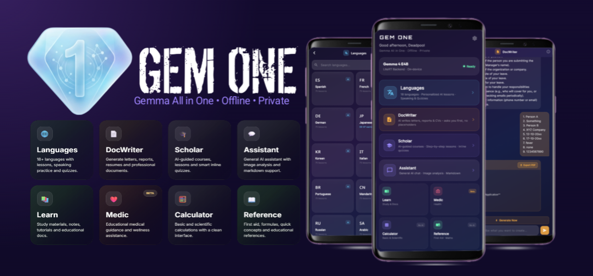

**On-device AI assistant for Android. No internet. No account. No data leaving your phone.**

Gem One runs Google's Gemma 4 E4B language model entirely on your device using the LiteRT runtime. It is built for communities with unreliable or no internet access - rural areas, low-connectivity regions, anyone who cannot depend on a stable data plan.

Six AI modules share a single on-device model: Medical Advisor, Scholar, Language Tutor, Document Writer, General Assistant, and Math Tutor. A standalone Calculator and offline Reference dictionary are also included.

---

## Screenshots

| Home | Onboarding | Settings |
|:---:|:---:|:---:|
| 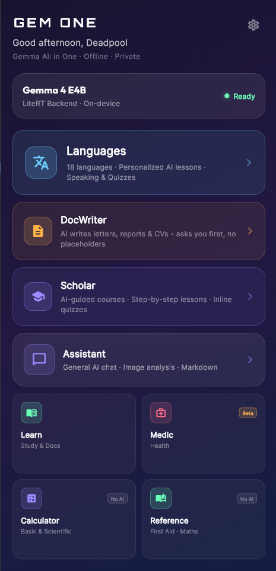 | 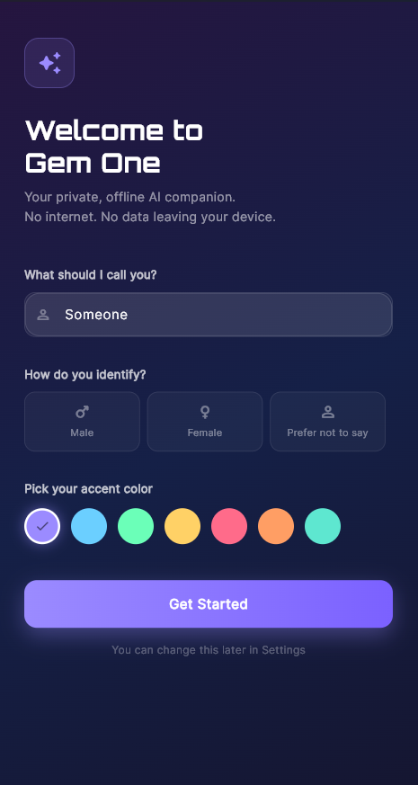 | 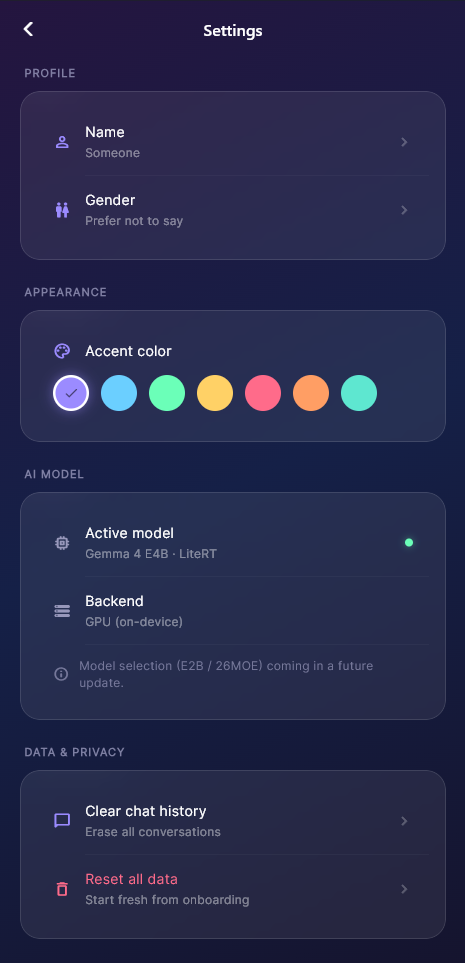 |

---

## Features

### Medical Advisor *(Beta)*

Ask about symptoms, medications, or first aid. The module uses **Retrieval-Augmented Generation (RAG)** - before your question reaches the model, it searches a local 28.5 MB medical knowledge base and injects the most relevant passage as context. Every reply is structured into three sections: *Likely cause(s)*, *What to do now*, and *When to seek care*.

The module always advises seeing a doctor for serious symptoms and is not a substitute for professional medical advice. The knowledge base is sourced from [MedlinePlus XML data](https://medlineplus.gov/xml.html), has not been clinically reviewed for this use case, and will be improved in future releases.

| Medic answering a query |
|:---:|
| 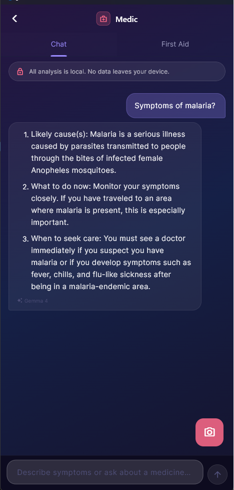 |

---

### Scholar - AI Tutor

Enter any topic and Scholar generates a structured course plan (modules and lessons) using a custom XML format the app parses into a visual lesson map. Each lesson delivers 2-3 short markdown-formatted paragraphs followed by a multiple-choice quiz. Quiz progress is persisted across app sessions. Math expressions render using LaTeX via `flutter_math_fork`.

| Create a course | Course overview | Lesson map |
|:---:|:---:|:---:|
| 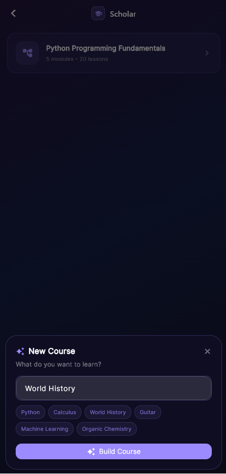 | 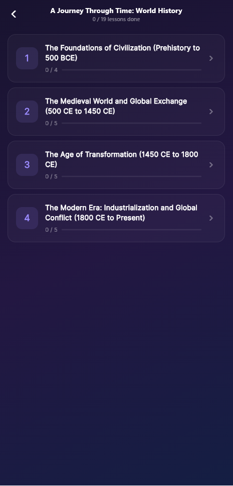 | 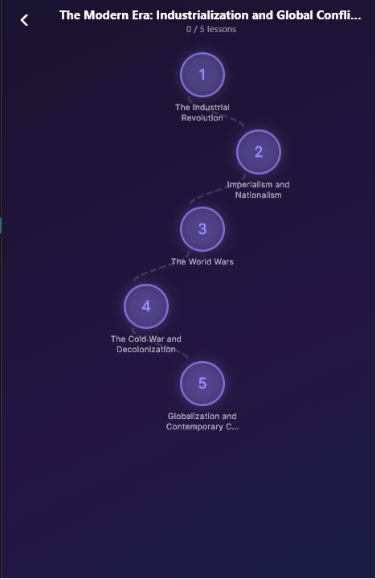 |

---

### Language Tutor

Learn vocabulary in any language. AI-generated word lists use the **full native script** (kanji+kana for Japanese, Arabic script, Devanagari for Hindi, Hangul for Korean, etc.). Fill-in-the-blank exercises show each word bank chip with native text on top and romanized pronunciation underneath. Pronunciation practice uses on-device speech-to-text and text-to-speech.

| Languages | Course levels | Level map | Flashcards | Vocab quiz |
|:---:|:---:|:---:|:---:|:---:|
| 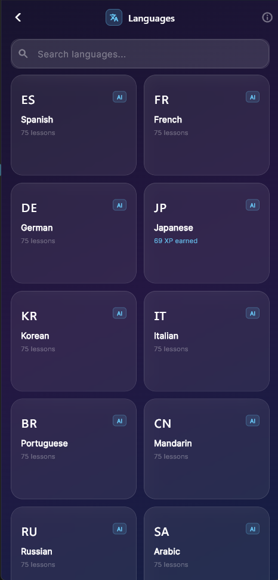 | 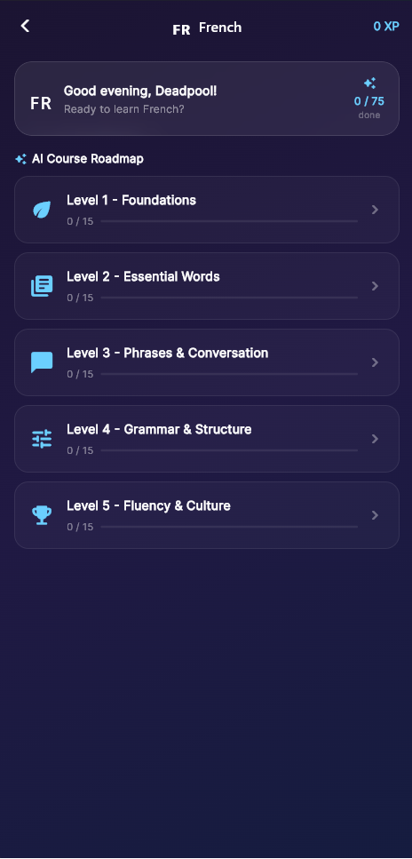 | 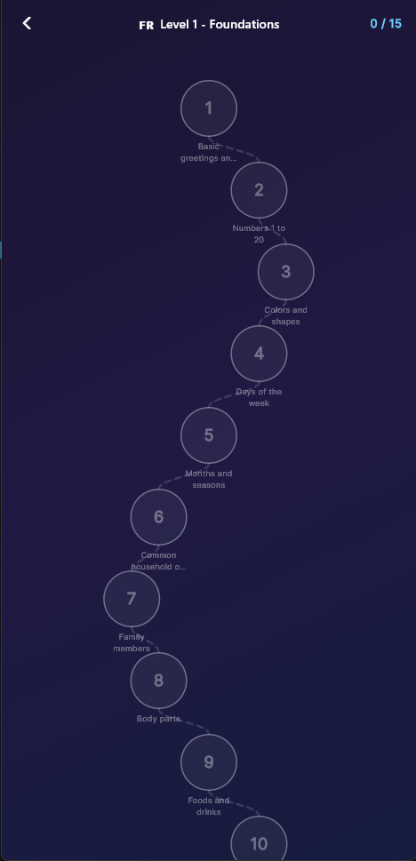 | 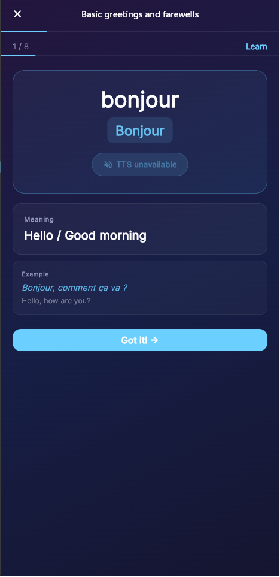 | 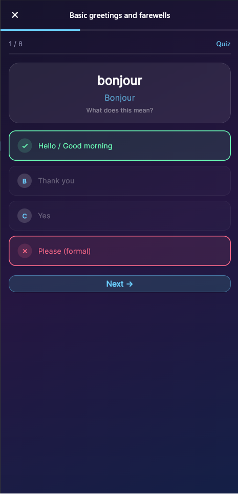 |

---

### Document Writer

Draft formal documents - resignation letters, CVs, complaints, reports, essays. The model gathers all required details in a single numbered question before generating, so the output never contains placeholder text. Attach images (handwritten notes, reference letters) and Gemma 4's vision model reads them directly. Generated documents can be exported as PDF. After generation, the session context is compacted so edit requests have a clean token budget.

| Gathering details | Generated document |
|:---:|:---:|
| 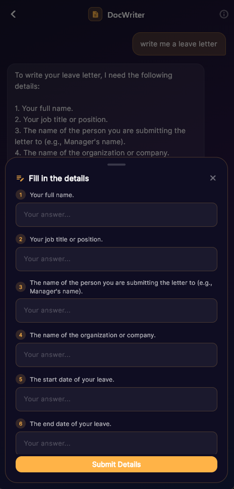 | 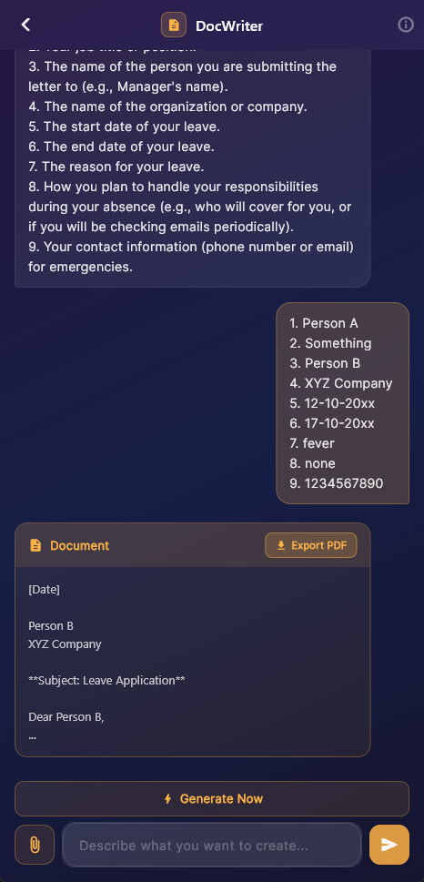 |

---

### General Assistant

A general-purpose chat assistant. Supports image attachment (camera or gallery) for visual questions - Gemma 4's vision model describes and answers questions about whatever you photograph. Has access to the calculator and medical search tools. Runs completely offline.

| Image analysis |
|:---:|
| 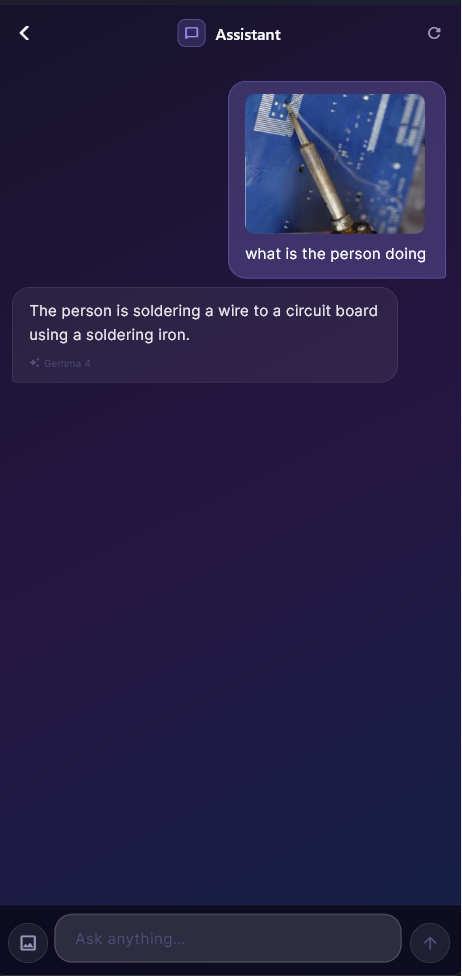 |

---

### Learn - Document Quiz

Upload a text file or document and the Learn module summarizes it and generates a practice quiz from the content. Useful for studying notes, textbook excerpts, or any uploaded material.

| Summary | Practice quiz |
|:---:|:---:|
| 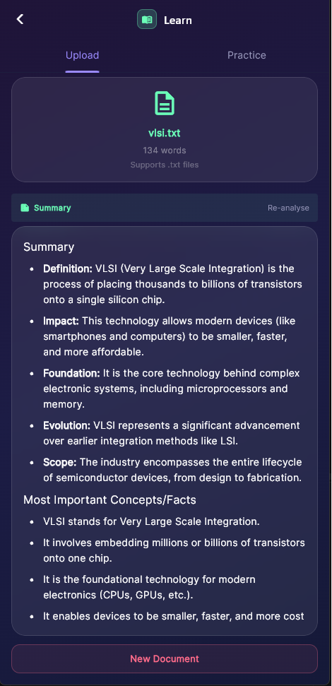 | 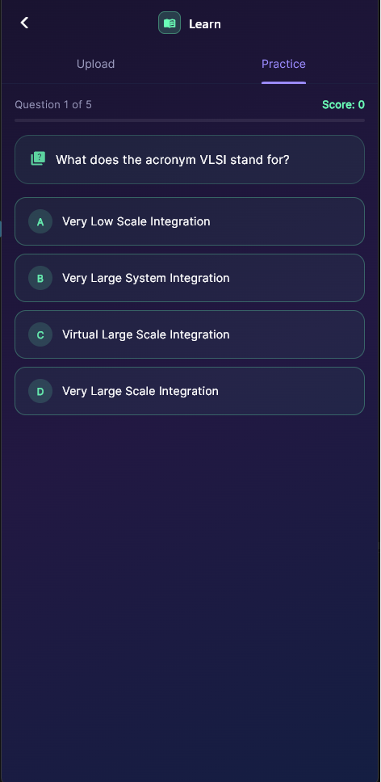 |

---

### Calculator

A standalone calculator hub with no AI involved. Includes standard arithmetic, scientific functions, percentage, discount, EMI/loan, interest, tip & bill split, currency converter, profit/loss, and unit converter - all working offline.

| Calculator home | Tip & bill split |
|:---:|:---:|
| 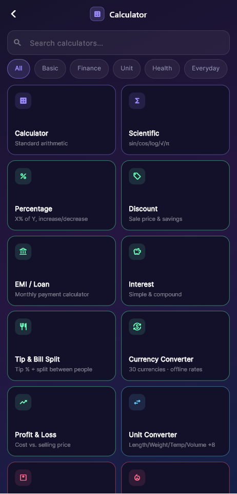 | 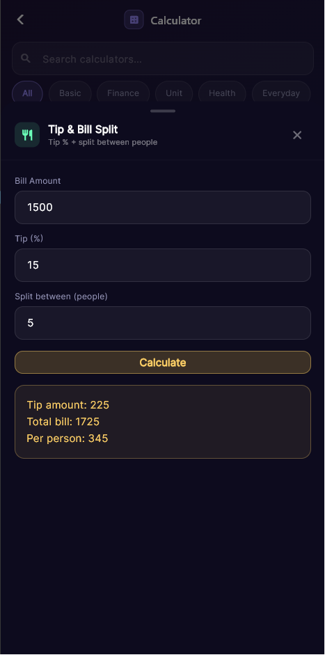 |

---

## How It Works

### Single Model, Multiple Personalities

`flutter_gemma` has no system-prompt API. Gem One injects each module's persona and instructions as the **first user-side message** of a fresh chat session:

```dart
final chat = await _model!.createChat();
// flutter_gemma has no system-prompt API; inject it as the first user turn
await chat.addQueryChunk(
  Message.text(text: systemPrompt, isUser: true),
);
```

Switching modules calls `switchMission()`, which disposes the current `InferenceChat` (freeing the native KV-cache) and opens a new one with the target module's prompt. One model instance - six personas.

### XML Tool Calling

Modules that need computation or knowledge lookup use a plain XML protocol taught to the model via its system prompt:

**Model emits:**
```xml
<gem_one_call><tool>calculator</tool><expr>15 * 4 + 12</expr></gem_one_call>
```

**App executes the tool and injects the result as the next user turn:**
```
<tool_response><tool>calculator</tool><result>72</result></tool_response>

Using the tool_response above, give the final answer to the user. Do not emit another tool call.
```

The trailing instruction prevents the model from entering an infinite loop by emitting a second tool call in response to the result. The loop is capped at 3 hops - if no final answer arrives, the user gets a graceful fallback.

**Available tools:**

| Tool | Trigger | Implementation |
|---|---|---|
| `calculator` | arithmetic expression | Recursive-descent Dart parser |
| `solve` | linear / quadratic equations | Symbolic solver, exact roots |
| `factor` | GCF, LCM, prime factorization | Pure Dart |
| `stats` | comma-separated numbers | Mean, median, mode, std dev, range |
| `convert` | unit conversion expression | SI-anchored, covers length/mass/temp/time/energy |
| `medical_search` | symptom or medicine name | RAG lookup into local JSON |

### Medical RAG

```
User query
  ↓
MedicalSearchService.search()
  ├── tokenize query, skip words < 3 chars
  ├── score every entry in medical_brain.json by keyword hits
  └── return top result, capped at 700 chars
  ↓
Inject result into prompt alongside the question
  ↓
Gemma 4 generates a structured reply
```

The 700-character cap is deliberate - it keeps the injected context within the model's practical token budget while still providing enough medical reference text to ground the response.

### Context Management

The model's 1024-token window requires active management across multi-turn conversations:

- **Exchange-count reset:** After 6 turns, a fresh `InferenceChat` is opened with the same system prompt re-injected. A banner notifies the user.
- **Degenerate reply detection:** A response under 4 words that is not a valid short answer (`yes`, `no`, `ok`, etc.) triggers an automatic session reset. This silently recovers from KV-cache corruption.
- **DocWriter compaction:** After generating a document, the session is replaced with a compact context containing only the document. Edit requests then have a full token budget.
- **Scholar local feedback:** Correct quiz answers show a local message - no model call - to avoid burning a turn on a one-word acknowledgment.

### Streaming

`BaseChatScreen` streams tokens from `chat.generateChatResponseAsync()` and renders them in real time for a typewriter effect. The `ToolParser` watches the streaming buffer for tool call prefixes and withholds partial `<gem_one_call>` tags from the UI until the full tag arrives:

```dart
static int trailingPartialOpenLength(String text) {
  for (int n = openTag.length - 1; n > 0; n--) {
    if (text.length >= n &&
        text.substring(text.length - n) == openTag.substring(0, n)) {
      return n;
    }
  }
  return 0;
}
```

---

## Architecture

```
lib/
├── main.dart                        # app entry, model boot, orientation lock
├── app/
│   └── app.dart                     # GemOneApp root widget
├── core/
│   ├── gemma_service.dart           # GemmaService state machine + GemmaServiceProvider
│   ├── xml_parser.dart              # ToolParser, ToolCall, ToolDispatcher
│   ├── medical_search_service.dart  # RAG search over bundled JSON
│   ├── calculator.dart              # recursive-descent expression evaluator
│   ├── scholar_tools.dart           # solve, factor, stats, convert
│   └── theme.dart                   # Material 3 dark theme, module accent colors
├── screens/
│   ├── home_screen.dart             # module grid + model status card
│   ├── base_chat_screen.dart        # abstract template: streaming, tools, reset logic
│   ├── medical_screen.dart          # extends BaseChatScreen, RAG sendMessage override
│   ├── scholar_screen.dart          # course map, lesson navigation
│   ├── scholar_lesson_screen.dart   # lesson rendering + quiz widget
│   ├── language_hub_screen.dart     # language selector + goal setting
│   ├── language_learn_screen.dart   # vocab lists + fill-in-the-blank
│   ├── document_screen.dart         # DocWriter with image attach + PDF export
│   ├── chat_screen.dart             # General Assistant with image attach
│   └── math_screen.dart             # Math Tutor
└── widgets/
    ├── chat_bubble.dart             # message bubble, tool-active indicator, LaTeX
    ├── animated_background.dart     # animated gradient backdrop
    ├── glass_card.dart              # frosted glass card component
    └── suggestion_chips.dart        # empty-state suggestion chips
```

**State management:** `GemmaServiceProvider` is an `InheritedWidget` wrapping a `ChangeNotifier` (`GemmaService`). No external state management packages are used anywhere in the app.

**Initialization sequence:**
1. `FlutterGemma.initialize()` - prepares the LiteRT framework
2. Portrait orientation lock + system UI setup
3. `MedicalSearchService.instance.init()` - parses `medical_brain.json` (28.5 MB) into memory
4. Launch `GemOneApp`

**Model lifecycle (`GemmaService`):**
```
idle → installing → loading → ready
                            ↘ error
```

**Module accent colors (Material 3 dark theme, DM Sans font):**

| Module | Accent |
|---|---|
| Medical | Teal `#5EE7D0` |
| Scholar | Blue `#74B9FF` |
| Language | Amber `#FF9E64` |
| General / DocWriter | Purple `#B48EFF` |

---

## Setup and Installation

### Prerequisites

- Flutter SDK ≥ 3.0 (Dart SDK `^3.11.5`)
- Android device or emulator with GPU support
- Sufficient free RAM to load the model (~3.5 GB file size)

### Steps

```bash
# 1. Clone the repository
git clone https://github.com/your-username/gem_one.git
cd gem_one

# 2. Install dependencies
flutter pub get

# 3. Add the model file
# Download gemma-4-E4B-it.litertlm and place it at:
#   assets/models/gemma-4-E4B-it.litertlm
# The file is not included in the repository due to its size (~3.5 GB).
# Once placed, it is bundled automatically into the APK as a Flutter asset.

# 4. Run on a connected Android device
flutter run
```

> The medical knowledge base (`lib/medical_data/medical_brain.json`) is included in the repository and requires no extra steps.

### Build

```bash
flutter build apk            # Android APK
flutter build apk --release  # Release APK
flutter build appbundle      # Android App Bundle for Play Store
```

### Analyze / Test

```bash
flutter analyze    # linter (extends flutter_lints)
flutter test       # unit tests
```

---

## Dependencies

| Package | Version | Purpose |
|---|---|---|
| `flutter_gemma` | `^0.15.0` | LiteRT inference, chat sessions, vision |
| `google_fonts` | `^6.2.1` | DM Sans typeface |
| `flutter_markdown` | `^0.7.3` | Markdown rendering in Scholar lessons |
| `markdown` | `^7.2.0` | Markdown parsing support |
| `flutter_math_fork` | `^0.7.2` | LaTeX math expression rendering |
| `image_picker` | `^1.1.2` | Camera / gallery image attachment |
| `file_picker` | `^8.1.2` | Document file attachment |
| `shared_preferences` | `^2.3.2` | Quiz progress and draft persistence |
| `speech_to_text` | `^7.0.0` | On-device speech recognition |
| `flutter_tts` | `^4.2.0` | On-device text-to-speech |
| `math_expressions` | `^2.6.0` | Supporting math utilities |
| `pdf` | `^3.11.0` | PDF generation for DocWriter |
| `printing` | `^5.13.2` | PDF preview and share |

---

## Privacy

- No network calls after installation
- No analytics, telemetry, or crash reporting of any kind
- No user accounts or sign-in required
- All conversations, documents, and quiz data stay on the device
- Your prompts never leave the phone - inference runs entirely locally

---

## Known Limitations

- **Medical module is beta.** The knowledge base is sourced from MedlinePlus (https://medlineplus.gov/xml.html) and has not been clinically reviewed for this use case. Do not use it as a substitute for professional medical advice.
- **1024-token context window.** Long conversations auto-reset after ~6 exchanges. A banner notifies the user when this happens.
- **High RAM requirement.** The model file is approximately 3.5 GB and must be fully loaded into memory for inference. Devices with insufficient free RAM will fail to load the model.
- **Android only.** iOS support requires additional configuration and an Apple Silicon device for on-device inference at acceptable speeds.
- **Model not included.** The `gemma-4-E4B-it.litertlm` file must be obtained separately and placed in `assets/models/`.

---

## License

Source code: [CC BY 4.0](https://creativecommons.org/licenses/by/4.0/)  
Gemma model weights: [Google Gemma Terms of Use](https://ai.google.dev/gemma/terms)

---

## Acknowledgements

Built with [Gemma 4](https://ai.google.dev/gemma) by Google DeepMind, running on-device via [LiteRT](https://ai.google.dev/edge/litert) through the [flutter_gemma](https://pub.dev/packages/flutter_gemma) package.

Submitted to the [Gemma 4 Good Hackathon](https://www.kaggle.com/competitions/gemma-4-good-hackathon) on Kaggle.
